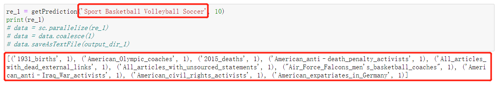
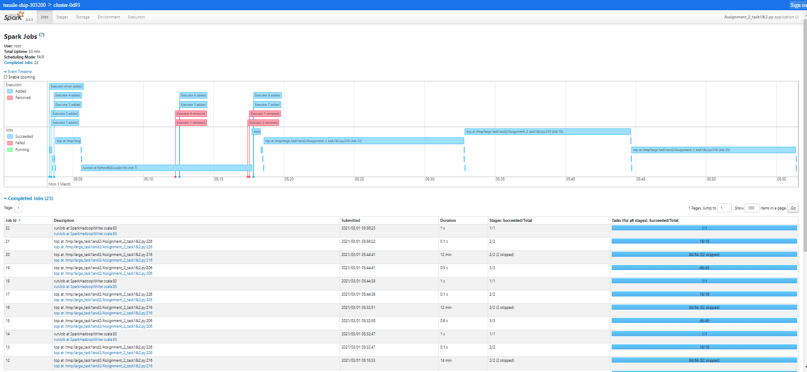

# TF-IDF String Similarity Comparison

## Introduction

The goal of this assignment is to implement a set of Spark programs in python (using Apache Spark).
Specifically, this project analyzed a data set consisting of New York City Taxi trip reports in the
Year 2013. The dataset was released under the FOIL (The Freedom of Information Law) and made public
by Chris Whong 

``https://chriswhong.com/open-data/foil_nyc_taxi/``

This project applies k-nearest neighbors classifier (KNN) in multiple steps to classify text documents.
The Term Frequency-Inverse Document Frequency (TF-IDF) matrix is a core algorithm to compare similarity distances between different string vectors. 

This ``screen_shots``directory contains spark history logs. The ``output`` directory contains result of the task1 and task2 for the big dataset.
The `small_data` contains small dataset with two files. The two pdf files are assignment requirement and my report.

## Getting Started
To run the task1&2 file, you need 5 arguments: path for wikiPagesFile, path for wikiCategoryFile, and output paths for result 1,2 and 3. 

    python spark-submit assignment_2_task1&2.py "path_1" "path_2" "path_3" "path_4" "path_5"``

To run the task3 file, do the same.

    python spark-submit assignment_2_task3.py "path_1" "path_2" "path_3" "path_4" "path_5"``
## Author
Ivan Chen
